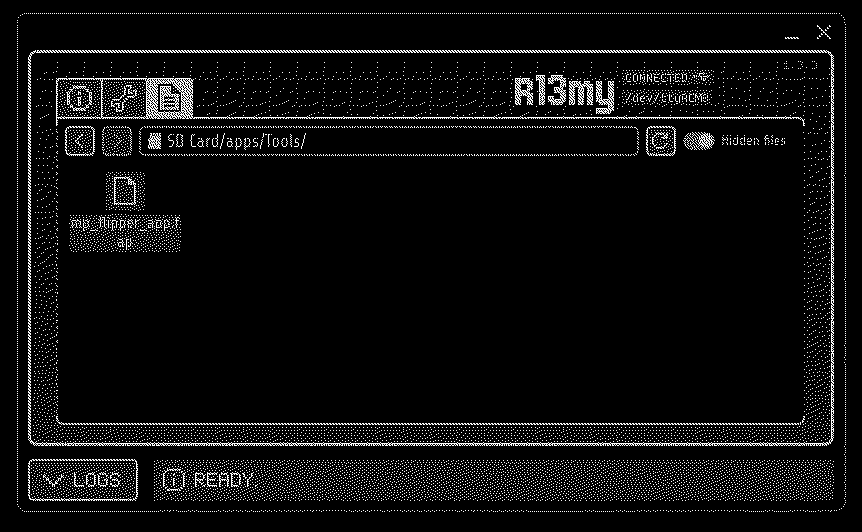
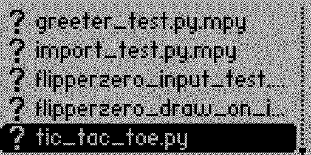

# MicroPython Flipper Zero

This branch contains the [FAP](https://developer.flipper.net/flipperzero/doxygen/apps_on_sd_card.html) version of the [MicroPython](https://micropython.org/) support for the famous [Flipper Zero](https://flipperzero.one/) gadget.
The results of the preceding research phase is still available in the [poc](https://github.com/ofabel/mp-flipper/tree/poc) branch.
The [lib](https://github.com/ofabel/mp-flipper/tree/lib) branch of this repository contains just the MicroPython library.
The progress of further research on what can be achieved when moving functionality to the firmware can be found in the [fork of the original firmware](https://github.com/ofabel/flipperzero-firmware).

Check the progress in this [issue](https://github.com/flipperdevices/flipperzero-firmware/issues/3559) and feel free to share your thoughts and ideas.

## Requirements

* [Git](https://git-scm.com/)
* [Make](https://www.gnu.org/software/make/)
* [uFBT](https://pypi.org/project/ufbt/) available in your `PATH` (or you have to adjust the [Makefile](./Makefile))
* [Flipper Zero](https://flipperzero.one/) (tested with firmware versions 0.99.1 and 0.100.3)

## Setup

```bash
git clone --recurse-submodules git@github.com:ofabel/mp-flipper.git
```

## Build

Just open a terminal and run the Makefile targets:

```bash
make build
```

You can also build an launch the application on the attached Flipper Zero device in one command:

```bash
make launch
```

## Install

To install a [release](https://github.com/ofabel/mp-flipper/releases) by hand, just copy the `mp_flipper_app.fap` file on the SD card of your Flipper (e.g. using the [qFlipper](https://flipperzero.one/downloads) app):



You should now be able to start the application on your Flipper: Apps > Tools > uPython

_You might need to unconnect qFlipper first to free some space in SRAM._

## Usage

Just place your Python files somewhere on the SD card.

The application just starts with an open file browser:



Here you can select any Python file to compile and execute from the SD card:


## Disclaimer

This FAP version requires about 120 kB from SRAM to start (needed for the Python runtime and compiler).
Due to memory fragmentation it's possible, that the application crashes when you start it (tested with the original 0.100.3 firmware).
If this happens, just try again (the crash doesn't harm your device).

**This is still work in progress, but already more than just a proof of concept.**

There is no documentation of the `flipperzero` module yet.
So just checkout the [examples](./examples/) for the syntax.
Sadly, REPL support is only available in fhe [firmware fork](https://github.com/ofabel/flipperzero-firmware) version.
